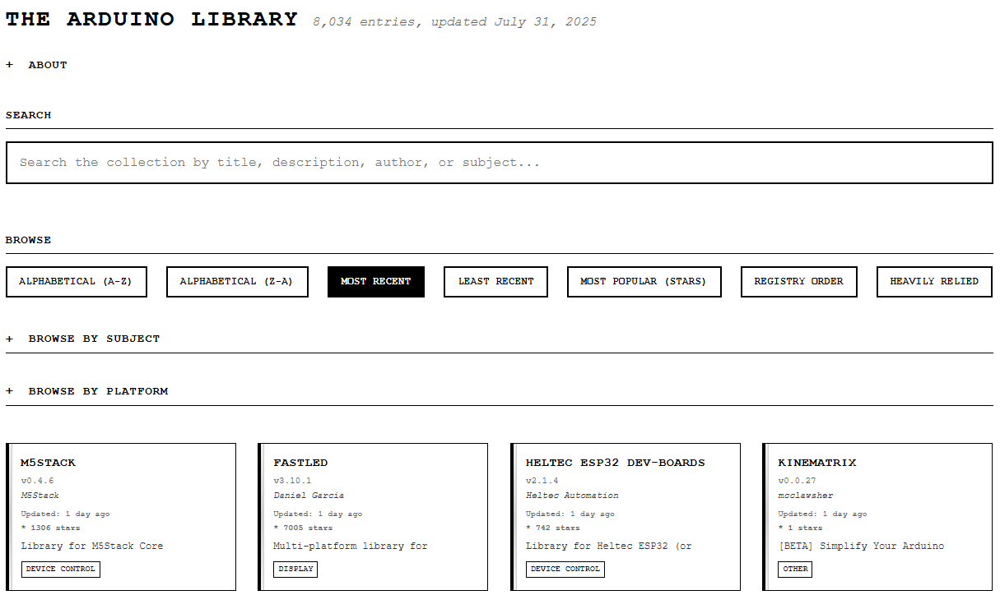

# The Arduino Library 


A comprehensive, searchable catalog of 8,000+ Arduino libraries from GitHub, updated automatically and presented through an intuitive web interface.

**Live Site:** [The Arduino Library](https://npuckett.github.io/arduino-libBrowser/)

---

## What is this site?

The Arduino Library Manager allows anyone to create and update libraries that are available through the Arduino IDE. When updating my own libraries in the registry I realized just how many were there and became curious to learn more about them. Unfortunately, I couldn't find a way to search or browse the libraries, so here we are. 


## How Does It Work?
This site takes advantage of the standard data structure required by the Arduino Registry. It polls the full [Arduino Registry](https://github.com/arduino/library-registry/blob/main/repositories.txt) and uses the library properties file along with updated information to generate a json database of the information. A quick update runs nightly with a full re-build weekly.


## How do I use it?

#### **Searching**
- Use the search box to find libraries by keyword, functionality, or author name
- Search looks through library names, descriptions, authors, and categories
- Results are grouped by match type: Library Names, Authors, Categories, and Descriptions
- Use the "Jump to" navigation links to quickly move between search result sections
- Click the "×" button to clear your search and return to browsing mode

#### **Browsing**
- **Browse by Subject**: Expand the "Browse By Subject" section to see categories like "Sensors", "Communication", "Display"
- **Browse by Platform**: Expand the "Browse by Platform" section to filter by Arduino architecture (ESP32, ESP8266, AVR, SAMD, etc.)
- **Toggle Categories**: Click a category or platform button to view only those libraries; click again to return to all libraries


#### **Sorting**
- **Most Recent**: See recently updated libraries (active development) - default view
- **Alphabetical**: Browse libraries A-Z or Z-A
- **Most Popular (Stars)**: Libraries with the most GitHub stars
- **Least Recent**: Oldest libraries (may be outdated)
- **Registry Order**: Random arrangement for discovery
- **Heavily Relied**: Libraries with many dependencies (widely used)

#### **Library Details**
Each library card shows:
- **Name & Version**: Current library version
- **Author**: Library developer (clickable to filter by author)
- **Description**: What the library does
- **Last Updated**: How recently the library was modified
- **GitHub Stars**: Community popularity indicator
- **Category**: Subject classification

#### **Detailed Information**
Click any library card to open a detailed view with:
- **Complete Description**: Full library documentation
- **GitHub Repository**: Direct link to source code
- **Version Information**: Current version and update history
- **Author Details**: Clickable author name to see all their libraries
- **Platform Support**: Supported Arduino architectures
- **Dependencies**: Required libraries (if any)
- **Alphabetical Neighbors**: Discover similar libraries
- **Copy Library Name**: Quick copy button for Arduino IDE installation

#### **Navigation Features**
- **Collapsible Sections**: Click section headers to expand/collapse filter options
- **Sticky Search**: Search box stays visible while scrolling through results
- **Search Navigation**: When searching, use "Jump to" links to navigate between result categories
- **Modal Navigation**: Browse related libraries without leaving the detail view

---

## How does it work?

### Architecture Overview

The Arduino Library Browser is a fully automated system that discovers, processes, and presents Arduino library data through a static web application with automated data pipeline.

### Data Collection & Processing

#### **Automated Discovery**
- **Daily Incremental Updates**: Scans GitHub every day for new and updated Arduino libraries
- **Weekly Full Enhancement**: Complete refresh of all library metadata and GitHub statistics
- **Smart Search Queries**: Uses multiple GitHub API strategies to ensure comprehensive coverage
- **Rate Limiting**: Respects GitHub API limits with intelligent retry logic

#### **Data Enhancement**
- **Library Properties Parsing**: Extracts metadata from `library.properties` files
- **GitHub Integration**: Enriches data with stars, forks, and activity metrics
- **Validation & Cleanup**: Ensures data quality and consistency
- **Incremental Updates**: Only processes changed libraries for efficiency

#### **Database Structure**
The system maintains a JSON database containing:
```json
{
  "enhanced_at": "2025-07-30T13:16:00Z",
  "total_libraries": 8027,
  "libraries": [
    {
      "name": "Library Name",
      "version": "1.2.3",
      "author": "Developer Name",
      "sentence": "Brief description",
      "paragraph": "Detailed description",
      "category": "Sensors",
      "architectures": "esp32,esp8266,avr",
      "repository_url": "https://github.com/user/repo",
      "github_stars": 42,
      "github_forks": 7,
      "github_updated_at": "2025-07-29T10:30:00Z",
      "processed_at": "2025-07-30T13:16:15Z"
    }
  ]
}
```

### Technical Implementation

#### **GitHub Actions Automation**
- **Daily Workflow**: Runs at 7 AM UTC, processes recent changes (15-30 minutes)
- **Weekly Workflow**: Runs Sundays at 6 AM UTC, full database refresh (4-6 hours)
- **Error Handling**: Robust retry logic and graceful failure recovery
- **Progress Tracking**: Detailed logging and statistics for monitoring

#### **Web Interface**
- **Static Site**: Pure HTML/CSS/JavaScript for fast loading and reliability
- **GitHub Pages**: Automatically deployed when data updates
- **Client-side Processing**: All filtering and sorting happens in the browser
- **Responsive Design**: Mobile-first approach with progressive enhancement

#### **Core Technologies**
- **PowerShell**: Data processing scripts with GitHub API integration
- **GitHub Actions**: Automated workflows for continuous updates
- **GitHub Pages**: Static site hosting with automatic deployment
- **Vanilla JavaScript**: Lightweight, dependency-free web interface

### Performance & Scalability

#### **Metrics**
- **Library Coverage**: 8,000+ libraries and growing
- **Update Frequency**: Daily incremental, weekly comprehensive
- **API Efficiency**: ~35,000-40,000 GitHub API calls per month (well within limits)
- **Site Speed**: < 2 second load times, client-side filtering for instant results

#### **Reliability**
- **Automated Backups**: Git history preserves all data versions
- **Graceful Degradation**: Site works even with partial data
- **Error Recovery**: Automatic retry logic for temporary failures
- **Monitoring**: GitHub Actions provide detailed execution logs

### Contributing & Development

#### **Getting Started**
1. **Fork** the repository
2. **Local Development**: Open `index.html` in a browser
3. **Data Updates**: Modify workflow files in `.github/workflows/`
4. **Testing**: Run workflows manually to test changes

#### **Key Files**
- `index.html` - Main web interface
- `style.css` - Styling and responsive design
- `.github/workflows/update-libraries.yml` - Daily update automation
- `.github/workflows/weekly-full-enhancement.yml` - Weekly refresh automation
- `AUTOMATION_STRATEGY.md` - Detailed technical documentation

#### **Issues & Feedback**
Found a bug or have a suggestion? Please [open an issue](https://github.com/npuckett/arduino-libBrowser/issues) on GitHub.

---

## License

This project is open source. Individual Arduino libraries maintain their own licenses - check each library's repository for specific terms.