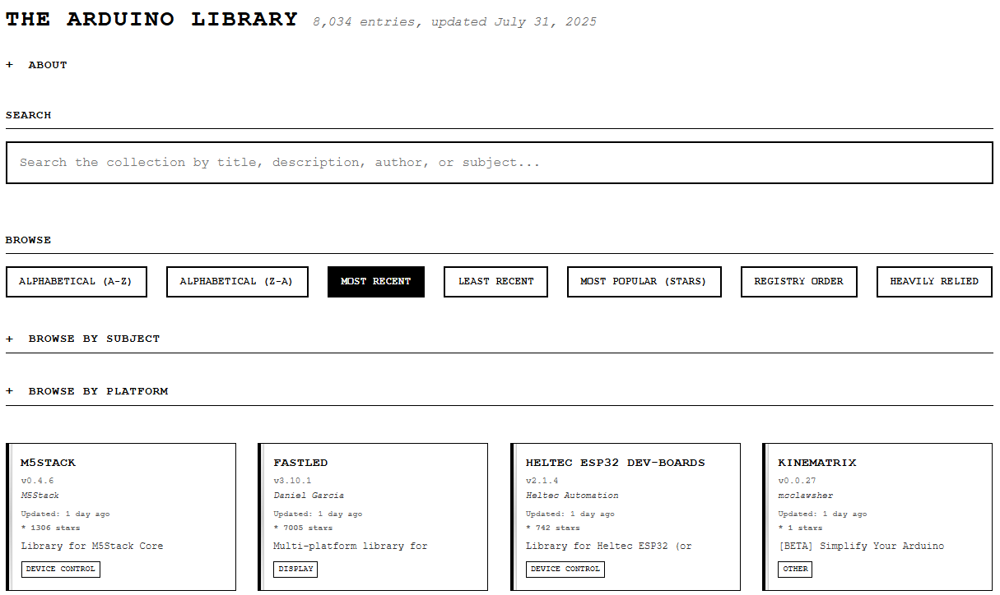

# The Arduino Library 


A comprehensive, searchable catalog of 8,000+ Arduino libraries from GitHub, updated automatically and presented through an intuitive web interface.

**Live Site:** [The Arduino Library](https://npuckett.github.io/arduino-libBrowser/)

---

## What is this site?

The Arduino Library Manager allows anyone to create and update libraries that are available through the Arduino IDE. When updating my own libraries in the registry I realized just how many were there and became curious to learn more about them. Unfortunately, I couldn't find a way to search or browse the libraries, so here we are. 


## How Does It Work?
This site takes advantage of the standard data structure required by the Arduino Registry. It polls the full [Arduino Registry](https://github.com/arduino/library-registry/blob/main/repositories.txt) and uses the library properties file along with updated information to generate a json database of the information. A quick update runs nightly with a full re-build weekly.


## How do I use it?

#### **Searching**
- Use the search box to find libraries by keyword, functionality, or author name
- Search looks through library names, descriptions, authors, and categories
- Results are grouped by match type: Library Names, Authors, Categories, and Descriptions
- Use the "Jump to" navigation links to quickly move between search result sections
- Click the "×" button to clear your search and return to browsing mode

#### **Browsing**
- **Browse by Subject**: Expand the "Browse By Subject" section to see categories like "Sensors", "Communication", "Display"
- **Browse by Platform**: Expand the "Browse by Platform" section to filter by Arduino architecture (ESP32, ESP8266, AVR, SAMD, etc.)
- **Toggle Categories**: Click a category or platform button to view only those libraries; click again to return to all libraries


#### **Sorting**
- **Most Recent**: See recently updated libraries (active development) - default view
- **Alphabetical**: Browse libraries A-Z or Z-A
- **Most Popular (Stars)**: Libraries with the most GitHub stars
- **Least Recent**: Oldest libraries (may be outdated)
- **Registry Order**: Random arrangement for discovery
- **Heavily Relied**: Libraries with many dependencies (widely used)

#### **Library Details**
Each library card shows:
- **Name & Version**: Current library version
- **Author**: Library developer (clickable to filter by author)
- **Description**: What the library does
- **Last Updated**: How recently the library was modified
- **GitHub Stars**: Community popularity indicator
- **Category**: Subject classification

#### **Detailed Information**
Click any library card to open a detailed view with:
- **Complete Description**: Full library documentation
- **GitHub Repository**: Direct link to source code
- **Version Information**: Current version and update history
- **Author Details**: Clickable author name to see all their libraries
- **Platform Support**: Supported Arduino architectures
- **Dependencies**: Required libraries (if any)
- **Alphabetical Neighbors**: Discover similar libraries
- **Copy Library Name**: Quick copy button for Arduino IDE installation

#### **Navigation Features**
- **Collapsible Sections**: Click section headers to expand/collapse filter options
- **Sticky Search**: Search box stays visible while scrolling through results
- **Search Navigation**: When searching, use "Jump to" links to navigate between result categories
- **Modal Navigation**: Browse related libraries without leaving the detail view

---

## How does it work?

### Architecture Overview

The Arduino Library Browser is a fully automated system that discovers, processes, and presents Arduino library data through a static web application with automated data pipeline.

### Data Collection & Processing

#### **Registry Synchronization**
- **Official Source**: Downloads the latest library list from [Arduino's Library Registry](https://github.com/arduino/library-registry/blob/main/repositories.txt)
- **Auto-Sync**: Registry is synchronized before each daily update run
- **New Library Detection**: New libraries added to Arduino's registry appear within 24 hours

#### **Automated Discovery**
- **Daily Incremental Updates**: Runs at 2 AM EST (7 AM UTC), processes new and updated libraries (~15-30 minutes)
- **Weekly Full Enhancement**: Runs Sundays at 1 AM EST (6 AM UTC), complete refresh of all library metadata (4-6 hours)
- **Rate Limiting**: Respects GitHub API limits with intelligent retry logic and exponential backoff

#### **Data Enhancement**
- **Library Properties Parsing**: Extracts metadata from `library.properties` files
- **GitHub Integration**: Enriches data with stars, forks, language, and activity metrics
- **Incremental Updates**: Only processes changed libraries for efficiency
- **Skip Logic**: Libraries unchanged for 30+ days are skipped in daily runs

#### **Database Structure**
The system maintains a JSON database containing:
```json
{
  "enhanced_at": "2025-07-30T13:16:00Z",
  "total_libraries": 8027,
  "libraries": [
    {
      "name": "Library Name",
      "version": "1.2.3",
      "author": "Developer Name",
      "sentence": "Brief description",
      "paragraph": "Detailed description",
      "category": "Sensors",
      "architectures": "esp32,esp8266,avr",
      "repository_url": "https://github.com/user/repo",
      "github_stars": 42,
      "github_forks": 7,
      "github_updated_at": "2025-07-29T10:30:00Z",
      "processed_at": "2025-07-30T13:16:15Z"
    }
  ]
}
```

### Technical Implementation

#### **GitHub Actions Automation**
The entire system runs automatically via two GitHub Actions workflows:

| Workflow | Schedule | Duration | Purpose |
|----------|----------|----------|---------|
| `update-libraries.yml` | Daily @ 2 AM EST | ~15-30 min | Sync registry, process new/updated libraries, deploy site |
| `weekly-full-enhancement.yml` | Sundays @ 1 AM EST | 4-6 hours | Full GitHub metadata refresh for all libraries |

- **Error Handling**: Robust retry logic and graceful failure recovery
- **Progress Tracking**: Detailed logging and statistics for monitoring
- **Auto-Deploy**: GitHub Pages automatically updates after each successful run

#### **Web Interface**
- **Static Site**: Pure HTML/CSS/JavaScript for fast loading and reliability
- **GitHub Pages**: Automatically deployed when data updates
- **Client-side Processing**: All filtering and sorting happens in the browser


#### **Core Technologies**
- **GitHub Actions**: Automated workflows with embedded PowerShell for data processing
- **GitHub Pages**: Static site hosting with automatic deployment
- **Vanilla JavaScript**: Lightweight, dependency-free web interface

### Performance & Scalability

#### **Metrics**
- **Library Coverage**: 8,000+ libraries and growing
- **Update Frequency**: Daily incremental, weekly comprehensive
- **API Efficiency**: ~35,000-40,000 GitHub API calls per month (well within limits)
- **Site Speed**: < 2 second load times, client-side filtering for instant results

#### **Reliability**
- **Automated Backups**: Git history preserves all data versions
- **Graceful Degradation**: Site works even with partial data
- **Error Recovery**: Automatic retry logic for temporary failures
- **Monitoring**: GitHub Actions provide detailed execution logs


#### **Issues & Feedback**
Found a bug or have a suggestion? Please [open an issue](https://github.com/npuckett/arduino-libBrowser/issues) on GitHub.

---

## Pipeline

The data pipeline (`scripts/pipeline.ts` + `pipeline/src/*`) is what keeps `output/libraries.json` current. It runs on a three-tier cron schedule and writes only what changed — the hourly run is a no-op when the upstream registry hasn't moved.

### Data sources

| Source | Role | Auth | Notes |
|--------|------|------|-------|
| **`library_index.json.gz`** ([Arduino library-registry](https://github.com/arduino/library-registry)) | **Primary.** The canonical list of every Arduino library + their `library.properties` metadata. | None | Downloaded with conditional `If-None-Match` against the stored ETag. |
| **GitHub REST API** (`/repos/{owner}/{repo}`) | **Secondary enrichment.** Adds `github_stars`, `github_forks`, `github_language`, `github_pushed_at`, etc. | `GITHUB_TOKEN` (raises the rate limit to 5,000/h) | Uses `If-None-Match` against per-repo ETags to skip unchanged repos. |
| `staff-pick-config.json` | Editor overrides for the Staff Pick widget. | None | Manually edited; the pipeline preserves manual picks unless `auto_update: true`. |

### Cron tiers

| Tier | Schedule | Command | What it does | API budget |
|------|----------|---------|--------------|------------|
| **Hourly** | `0 * * * *` (`.github/workflows/hourly-sync.yml`) | `pnpm pipeline:hourly` → `sync` | Fetches `library_index.json.gz`. If unchanged, exits 0. If changed, computes a diff (new/updated/removed) and enriches *only new* libraries. | ~50 calls/day |
| **Daily** | `0 6 * * *` (`.github/workflows/daily-enrich.yml`) | `pnpm pipeline:daily` → `enrich` | Walks `output/libraries.json` and re-fetches any library whose stored ETag no longer matches (i.e. the repo changed on GitHub). | ~500 calls/day |
| **Weekly** | `0 4 * * 0` (`.github/workflows/weekly-stats.yml`) | `pnpm pipeline:weekly` → `stats` | Computes `trending` (delta stars since last run) and emits `output/stats.json` + `output/picks.json` (themed + editor picks). | None (local compute only) |

For a one-shot full refresh that ignores ETags, use `pnpm pipeline:hourly -- --full`.

### Running locally

```bash
# Install deps (Node 20+ required)
pnpm install

# Hourly sync (idempotent)
pnpm pipeline:hourly

# Dry-run: compute everything but write nothing
pnpm pipeline:dry

# Daily enrichment
pnpm pipeline:daily

# Weekly stats rollup
pnpm pipeline:weekly

# Everything in one go
node --experimental-strip-types scripts/pipeline.ts all --verbose
```

The script reads from the project root (`output/libraries.json`, `state/sync-state.json`) and writes the same paths.

### Schema versioning

The on-disk schema is versioned via `state/sync-state.json` → `schema_version`. The current schema is **v2**.

| Field | Since | Notes |
|-------|-------|-------|
| `enhanced_at`, `github_*`, `version_history` | v2 | Added when the pipeline migrated from PowerShell to TypeScript in 2026. |
| `processed_at`, `properties`, `repository_*` | v1 | Legacy PowerShell fields, still present for backward compatibility. |

A future v3 will fold `properties` (a redundant copy of the top-level fields) into a single source of truth. Migrations are applied automatically by `loadState()`.

### Debugging locally

```bash
# Verbose logging (pretty-printed if stdout is a TTY, JSON otherwise)
node --experimental-strip-types scripts/pipeline.ts sync --verbose

# Inspect current state
cat state/sync-state.json | jq .

# Force re-enrichment of every library
node --experimental-strip-types scripts/pipeline.ts sync --full --verbose

# Run unit tests
pnpm test

# Type-check only
pnpm typecheck
```

Exit codes:

- `0` — success (including no-op runs)
- `1` — transient error (network, rate limit, upstream 5xx). The workflow will retry on the next cron tick.
- `2` — config error (bad CLI, missing input files, schema mismatch). The workflow will NOT retry.

### File layout

```
scripts/pipeline.ts             CLI entry point — dispatches on subcommand
pipeline/src/
  sources/
    arduino-index.ts            Fetch + cache library_index.json.gz (ETag-aware)
    arduino-properties.ts       Parse library.properties fixtures
  transforms/
    diff-detector.ts            Compute new / updated / removed
    github-enrich.ts            Per-repo GitHub API + ETag bookkeeping
    stats.ts                    Aggregate counts, trending deltas
    themed-picker.ts            Editor + theme pick generation
  utils/
    logger.ts                   pino with pino-pretty on TTY
    state.ts                    Load/save state/sync-state.json atomically
    io.ts                       Atomic JSON read/write
  types.ts                      Library, ArduinoIndexEntry, SyncState, etc.
pipeline/tests/
  fixtures/                     Sample data for unit tests
  unit/                         Vitest suites
```

---

## License

This project is open source. Individual Arduino libraries maintain their own licenses - check each library's repository for specific terms.